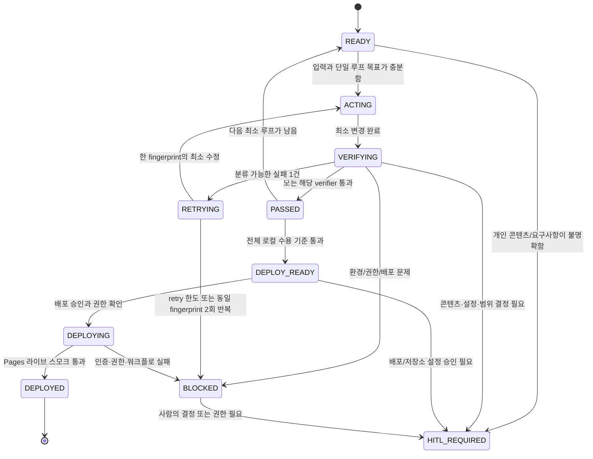

# AORR 상태 머신 설계 — 개인 프로페셔널 정적 웹사이트

## 1. Target

### 제품 및 배포 목표

- GitHub Pages에서 별도 백엔드 없이 동작하는 개인 프로페셔널 웹사이트를 제공한다.
- 최종 배포 루트에는 최소한 다음 파일이 존재한다.
  - `index.html`
  - `styles.css`
  - `script.js`
- HTML, CSS, JavaScript만 사용한다. 게임 코드는 `script.js`에 두거나, 정적 JavaScript 모듈로 분리할 수 있다.
- Desktop과 mobile에서 읽기 쉽고 가로 스크롤 없이 작동한다.
- 상단 기본 내비게이션에는 `Games` 탭이 있으며, 해당 화면에서 Snake(지렁이) 게임을 키보드와 모바일 터치로 조작할 수 있다.

### 입력 자료

| 입력 | 사용 목적 | 상태 |
|---|---|---|
| 사용자 제공 이름, 소개, 경력, 프로젝트, 연락 수단 | 프로페셔널 콘텐츠 작성 | [사람 확인 필요] |
| 저장소의 기존 HTML/CSS/JS 및 테스트 | 보존할 계약과 기존 동작 식별 | 제공됨 |
| GitHub Pages 저장소/배포 설정 | 공개 URL 및 배포 방식 확인 | [사람 확인 필요] |
| 브랜드 색상, 언어, 디자인 선호 | 시각 디자인 결정 | [사람 확인 필요] |
| 게임 추가 기능 | 점수, 난이도, 일시정지 등 범위 결정 | Step 1에 별도 `[게임 추가 기능:]` 항목 없음 |

### 필수 화면과 섹션

- Home: 이름/역할, 짧은 소개, 주요 행동 유도.
- Work 또는 Projects: 검증 가능한 프로젝트와 링크.
- Principles 또는 Skills: 전문 분야와 작업 원칙.
- Contact: 사용자가 명시적으로 승인한 공개 연락 수단만 표시.
- Games: Snake 게임, 조작 안내, 상태, 점수, 시작/재시작 제어.
- 공통: 건너뛰기 링크, 키보드 탐색 가능한 기본 내비게이션, 모바일 반응형 레이아웃.

### 완료 기준

| 대상 | 완료 기준 |
|---|---|
| Desktop | 1440px에서 주요 콘텐츠, 내비게이션, 게임 보드에 가로 스크롤이 없고 게임을 키보드로 완주 가능한 방식으로 조작할 수 있다. |
| Tablet | 768px에서 카드/내비게이션/게임 UI가 겹치거나 잘리지 않는다. |
| Mobile | 320px에서 가로 스크롤이 없고, 모든 터치 제어 요소가 최소 44×44 CSS px이며 스와이프와 방향 버튼이 작동한다. |
| 정적 배포 | 루트의 `index.html`, `styles.css`, `script.js` 및 필요한 정적 자산만으로 GitHub Pages에서 직접 로드된다. |

> 구조 결정: 현재 저장소에는 CSS와 게임 JavaScript가 하위 폴더에 있다. 최종 요구사항을 충족하려면 배포 루트에 `styles.css`와 `script.js`를 두도록 구성하거나, 빌드가 이 파일들을 루트로 복사해야 한다. 어느 방식을 채택할지는 정적 빌드 정책과 함께 확정한다.

---

## 2. AORR 상태 머신



### 상태 규칙

| 상태 | 진입 조건 | 허용 행동 | 종료 조건 |
|---|---|---|---|
| `READY` | 다음 루프의 입력과 목표가 확정됨 | 범위·verifier 선택 | `ACTING` 또는 `HITL_REQUIRED` |
| `ACTING` | 단일 실패 원인 또는 단일 기능 목표가 있음 | 최소 파일만 생성/수정 | `VERIFYING` |
| `VERIFYING` | 구현 변경이 끝남 | 지정 verifier, 회귀 verifier 실행 | `PASSED`, `RETRYING`, `BLOCKED`, `HITL_REQUIRED` |
| `RETRYING` | 한 개의 분류 가능한 실패 | 원인 하나만 최소 수정 | 같은 verifier로 `VERIFYING` |
| `PASSED` | 해당 루프 기준 통과 | 결과 기록, 다음 루프 선택 | `READY` 또는 `DEPLOY_READY` |
| `DEPLOY_READY` | 모든 로컬 수용·회귀 기준 통과 | 배포 전 diff/secret/권한 확인 | `DEPLOYING` 또는 `HITL_REQUIRED` |
| `DEPLOYING` | 명시적 배포 승인과 권한 있음 | push/workflow/Pages 관찰 | `DEPLOYED` 또는 `BLOCKED` |
| `DEPLOYED` | 공개 URL 및 핵심 자산의 라이브 검증 통과 | 결과 기록 | 종료 |
| `BLOCKED` | 환경, 인증, 권한 또는 재현 불가 오류 | 증거 기록, 변경 중지 | `HITL_REQUIRED` |
| `HITL_REQUIRED` | 사람의 콘텐츠·범위·설정 결정 필요 | 질문과 선택지 제시, 무단 변경 금지 | 입력 확정 후 `READY` |

---

## 3. Act / Observe / Reason / Repeat / Stop 정책

### Act: 한 개발 루프의 최소 작업 단위

- 하나의 사용자 관찰 가능 계약만 추가하거나, 하나의 실패 fingerprint만 수정한다.
- 허용 수정 범위는 해당 루프 표의 `수정 가능 파일`로 제한한다.
- 새 파일은 정적 HTML/CSS/JS, 테스트, 문서, GitHub Pages 워크플로에 한한다. 외부 런타임·백엔드는 생성하지 않는다.
- 콘텐츠가 확정되지 않았으면 자리표시자나 추정된 경력 정보를 작성하지 않고 `HITL_REQUIRED`로 전환한다.

### 실행 가능한 로컬 verifier 명령

명령은 Node.js가 있는 환경을 전제로 한다. 정적 사이트라서 의존성 설치 없이 실행되도록 유지한다.

```powershell
# 파일 존재 및 HTML의 로컬 참조 확인
Test-Path index.html; Test-Path styles.css; Test-Path script.js

# 기존 Node 테스트가 있는 경우
npm test

# 정적 산출물 생성 정책이 있는 경우
npm run build

# 빌드 산출물 또는 저장소 루트를 로컬에서 제공
python -m http.server 8000

# 선택: Node만 있는 경우의 정적 서버
npx --yes serve .

# 공백 오류 및 추적 파일 확인
git diff --check
git status --short
```

---

## Self-Correcting TDD Loop

> 한국어 운영 기준: 아래의 한국어 섹션을 이 루프의 기준 문서로 사용한다. 같은 의미의 영문 표기는 도구명·명령어를 정확히 보존하기 위한 보조 표기다.

### 검증 도구 현황 (설계만 수행, 실행하지 않음)

| 도구 | 확인 근거 | 사용할 실제 명령 | 제한 |
|---|---|---|---|
| Node 테스트 | `package.json` | `npm test` | 기존 `node --test`만 실행한다. |
| 정적 build | `package.json` | `npm run build` | `dist/`를 다시 생성하므로 검증 루프에서만 실행한다. |
| 통합 검사 | `package.json` | `npm run check` | 기존 test 후 build를 실행한다. |
| Git | 저장소 존재 | `git diff --check`, `git status --short`, `git ls-files` | 공백 오류·변경 범위·추적 파일만 확인한다. |
| Python/Python3 | Windows 실행 별칭 | `python -m http.server 8000` 또는 `python3 -m http.server 8000` | 실제 runtime은 아직 확인하지 않았다. 실패는 `ENVIRONMENT`다. |
| 브라우저 CLI | Chrome/Edge/Playwright 명령 미확인 | 없음 | 자동 viewport·Console 검증을 가정하지 않는다. |
| Claude Code | `claude` 2.1.201 설치 확인 | `claude --version`, `claude --help` | CLI 설치만 확인했으며 모델 접근은 미확인이다. |

확인된 기존 테스트 파일은 `build.test.mjs`, `game-input.test.mjs`, `game-page.test.mjs`, `navigation.test.mjs`, `site-shell.test.mjs`, `snake-core.test.mjs`다.

### 상태별 실행 규칙과 실패 기록

1. `READY`: 관찰 가능한 계약 하나와 primary verifier 하나를 고른다.
2. `ACTING`: 그 계약을 만족시키는 최소 파일만 수정한다.
3. `VERIFYING`: primary verifier를 실행하고, 통과 시 `npm test`를 실행한다. 경로·build 변경이면 `npm run build`도 실행한다.
4. `PASSED`: 증거를 기록하고 다음 최소 계약으로 이동한다.
5. `RETRYING`: 원인 하나만 분류하고 관련 파일만 고친 뒤 같은 verifier를 다시 실행한다.
6. `BLOCKED`/`HITL_REQUIRED`: 환경·권한·배포 설정·개인 콘텐츠 문제는 코드로 우회하지 않고 중지한다.

```text
루프 ID / verifier:
실행 명령:
exit code:
검증 계약:
결과: PASS | FAIL
핵심 오류:
관련 파일/행:
브라우저 Console 메시지:
오류 fingerprint: <분류>|<명령>|<파일:행>|<정규화된 오류>
실패 분류:
가설 (retry만):
변경 파일 (retry만):
회귀 verifier 및 결과:
```

### Verifier 중심 검증 매트릭스

| 영역 | primary verifier | 관찰 기준 | 실패 분류 | GREEN 및 회귀 |
|---|---|---|---|---|
| 기본 파일 | `Test-Path index.html`, `Test-Path styles.css`, `Test-Path script.js` | 최종 루트에 세 파일 존재 | `HTML_STRUCTURE` | 모두 true 후 `npm test` |
| 경로·대소문자·로컬 경로 | `rg`로 `href`/`src` 검사, `rg --files` 비교, `file:`/드라이브 경로 탐색 | 모든 local 참조가 실제 파일과 대소문자까지 일치, 절대 로컬 경로 없음 | `HTML_STRUCTURE` | scan 후 build |
| HTML | 기존 navigation/site-shell/game-page 테스트와 정적 점검 | 문서 구조, title, viewport, main/nav, nav 링크, Games, `img alt`, 내부 anchor | `HTML_STRUCTURE` | 대상 테스트 후 전체 `npm test` |
| CSS | 사용 가능한 브라우저가 생긴 경우만 viewport 검사 | 약 375/768/1440px에서 가로 overflow 없음, nav와 Games UI 사용 가능 | `CSS_RESPONSIVE` | 세 viewport 후 테스트 |
| JavaScript | 테스트, build, 가능 시 Console | 문법·로드·초기화·null 참조 오류 없음 | `JAVASCRIPT` | tests/build, 관찰 가능 시 Console 0 |
| 중복 이벤트/타이머 | 명시적 테스트 또는 브라우저 시나리오 | Games 재진입과 start/pause/restart가 이벤트·이동을 중복시키지 않음 | `JAVASCRIPT`/`GAME_CONTROL` | 시나리오와 게임 회귀 통과 |
| 게임 로직 | `snake-core.test.mjs` | 시작·일시정지·재시작·음식·성장·점수·벽/몸 충돌 | `GAME_LOGIC` | core 후 전체 suite |
| 게임 조작 | `game-input.test.mjs`와 가능 시 상호작용 | Arrow/WASD/swipe/버튼 동일 명령, 즉시 반대 방향 거부 | `GAME_CONTROL` | input/core/full suite |
| 로컬 HTTP | Python runtime 확인 후에만 서버 실행 | `/`, HTML/CSS/JS HTTP 200 | `ENVIRONMENT`/`HTML_STRUCTURE`/`JAVASCRIPT` | HTTP 후 build |
| Pages 호환성 | build test, `npm run build`, 경로/추적 파일 검사 | root index, 정적 상대 경로, backend/local-FS/API 미사용, secret/dev artifact 없음 | `DEPLOYMENT` | `npm run check`, diff check |

현재 CSS는 `assets/styles.css`, 게임 JS는 `games/`와 `assets/`에 있다. 최종 요구인 root `styles.css`와 `script.js`는 승인된 구현/build 정책으로 제공되기 전까지 **RED**이며, 추정으로 PASS 처리하지 않는다.

### 작은 Self-Correcting TDD 루프

| 루프 | RED verifier | 최소 Act | PASS | 다음 |
|---|---|---|---|---|
| V1 파일·경로 | root 파일 및 링크/대소문자/로컬 경로 scan | root entry asset 또는 build-copy 정책만 변경 | 모든 경로 resolve | V2 |
| V2 HTML | 기존 markup 테스트 + checklist | semantic/nav/Games/alt/anchor만 수정 | 대상·전체 테스트 GREEN | V3 |
| V3 반응형 | 브라우저 도구가 있을 때 viewport 관찰 | 문제 selector 하나만 수정 | 375/768/1440 사용 가능, overflow 없음 | V4 |
| V4 JS 초기화 | tests/build/가능 시 Console | module/binding/init 경로 하나만 수정 | load/runtime 오류 없음 | V5 |
| V5 게임 상태 | 실패한 core 테스트 | 상태 전이 하나만 수정 | 시작/일시정지/재시작·음식·점수·충돌 통과 | V6 |
| V6 게임 조작 | input 테스트 + 상호작용 | adapter/listener 하나만 수정 | 입력 동등성·중복 실행 없음 | V7 |
| V7 로컬 HTTP | runtime 확인 후 server/HTTP | static path 원인만 수정 | HTML/CSS/JS 200 | V8 |
| V8 Pages artifact | `npm run check`, artifact/path 검사 | whitelist/path 원인 하나만 수정 | 정적 Pages artifact만 존재 | `DEPLOY_READY` |

일시정지와 Games 재진입 시 중복 실행 방지는 명시적 테스트 또는 실제 브라우저 상호작용 verifier가 있어야 PASS다. 현재 마크업/core 테스트만으로는 충분하지 않다.

### Retry 및 중지 정책

- 분류는 `HTML_STRUCTURE`, `CSS_RESPONSIVE`, `JAVASCRIPT`, `GAME_LOGIC`, `GAME_CONTROL`, `CONTENT`, `TEST`, `ENVIRONMENT`, `GITHUB_PERMISSION`, `DEPLOYMENT`, `UNKNOWN`만 사용한다.
- 한 retry에는 원인 하나와 관련 파일만 수정한다. 테스트 삭제·약화, 무관한 재작성, framework 전환, 통과 기능의 회귀는 금지한다.
- retry마다 가설, 변경 파일, 명령, exit code, 결과, 회귀 결과를 기록한다.
- 오류 하나당 최대 3회지만, 같은 정규화 fingerprint가 두 번째 발생하면 즉시 `BLOCKED`로 중지한다.
- runtime/포트/브라우저 및 GitHub 인증·Actions·Pages 권한 오류는 앱 코드로 수정하지 않는다.
- 개인정보·링크, 콘텐츠 삭제, 외부 서비스, 저장소 설정, 상충 요구사항은 `HITL_REQUIRED`다.

### Claude Code 독립 Verifier

Claude Code CLI 2.1.201은 설치돼 있다. 도움말의 `sonnet` alias는 계정의 Sonnet 5 접근이나 실제 Sonnet 5 model ID를 보장하지 않는다. 이 단계에서 모델 호출을 하지 않았으므로 **Sonnet 5 사용 가능 여부는 미확인**이다.

승인된 미래 verifier 루프에서만 읽기 전용으로 `--model sonnet`과 JSON 출력을 호출하고, 실제 반환 model ID·명령·exit code를 기록한다. 실제 ID가 Sonnet 5일 때만 Sonnet 5 사용으로 기록한다. 아니면 성공한 호출의 실제 Sonnet model ID를 기록한다. alias/인증 실패 시 증거를 기록하고 중지하며, 모델명을 추측하거나 자동 전환하지 않는다. Claude의 결과는 결정적 테스트 또는 브라우저 관찰로 재현되기 전까지 조언일 뿐이다.

```powershell
claude --model sonnet --output-format json --no-session-persistence --allowed-tools "Read,Glob,Grep" --print "Read-only verifier: inspect this static site. Report reproducible issues with file/line, classification, and evidence. Do not edit files or run git commands."
```

### Verifier inventory (design-only)

No site test, build, server, browser verification, or Claude model call was run while adding this design.

| Tool | Confirmed evidence | Executable command | Limitation |
|---|---|---|---|
| Node tests | `package.json` | `npm test` | Runs existing `node --test` only. |
| Static build | `package.json` | `npm run build` | Recreates `dist/`. |
| Combined check | `package.json` | `npm run check` | Existing test followed by build. |
| Git | repository | `git diff --check`; `git status --short`; `git ls-files` | Scope/whitespace only. |
| Python/Python3 | Windows app aliases | `python -m http.server 8000` / `python3 -m http.server 8000` | Runtime itself is unconfirmed. |
| Browser CLI | none found for chromium/chrome/msedge/playwright | N/A | No automated viewport/Console claim. |
| Claude Code | `claude` 2.1.201 | `claude --version`; `claude --help` | Installation only; model access unconfirmed. |

Existing tests: `build.test.mjs`, `game-input.test.mjs`, `game-page.test.mjs`, `navigation.test.mjs`, `site-shell.test.mjs`, `snake-core.test.mjs`.

### State procedure and failure record

`READY`: choose one observable contract and primary verifier. `ACTING`: make the smallest related change. `VERIFYING`: run the primary verifier, then `npm test`, plus `npm run build` for path/build changes. Green enters `PASSED`; one classified cause enters `RETRYING`; environment, permissions, deployment setup, or uncertain content enters `BLOCKED`/`HITL_REQUIRED`.

```text
Loop ID / verifier:
Command:
Exit code:
Checked contract:
Result: PASS | FAIL
Key error message:
Related file and line:
Browser console messages:
Failure fingerprint: <category>|<command>|<file:line>|<normalized error>
Classification:
Hypothesis (retry only):
Files changed (retry only):
Regression verifier and result:
```

### Verifier matrix

| Area | Primary verifier | Required observation | Class | Green / regression |
|---|---|---|---|---|
| Root files | `Test-Path index.html`, `Test-Path styles.css`, `Test-Path script.js` | All three final root files exist | `HTML_STRUCTURE` | all true, then `npm test` |
| Links/path/case | `rg` `href`/`src` plus `rg --files`; scan `file:`, drive paths, `/Users/`, `C:/` | Local references exist with matching case; no local absolute paths | `HTML_STRUCTURE` | clean scan, then build |
| HTML | existing navigation/site-shell/game-page tests + static review | document structure, title, viewport, main/nav, nav targets, Games, `img alt`, internal anchors | `HTML_STRUCTURE` | target then full test |
| Responsive CSS | browser verifier only when available | about 375/768/1440px: no x-overflow; nav/game usable | `CSS_RESPONSIVE` | same viewports, then tests |
| JavaScript | tests, build, Console when available | no syntax/load/init/null-reference error | `JAVASCRIPT` | tests/build; Console 0 when observable |
| Duplicate listeners | explicit test or browser scenario | reopening Games/start-pause-restart never doubles events/movement | `JAVASCRIPT`/`GAME_CONTROL` | scenario + game regressions |
| Game core | `snake-core.test.mjs` | start, pause, restart, food, growth, score, wall/body collision | `GAME_LOGIC` | core then full suite |
| Game control | `game-input.test.mjs` plus interaction | Arrow/WASD/swipe/buttons agree; reverse rejected | `GAME_CONTROL` | input/core/full suite |
| Local HTTP | only after Python runtime confirmation | `/`, HTML/CSS/JS HTTP 200 | `ENVIRONMENT`/`HTML_STRUCTURE`/`JAVASCRIPT` | HTTP then build |
| Pages | build test, build, path scan, tracked-file review | root index; static relative paths; no backend/local-FS/API; no secret/dev artifact | `DEPLOYMENT` | `npm run check`, diff check |

Current CSS is `assets/styles.css`; game JS is under `games/` and `assets/`. Required root `styles.css` and `script.js` remain RED until an approved implementation/build policy exposes them. They must not be assumed PASS.

### Small verifier-first loops

| Loop | RED verifier | Minimum Act | PASS | Next |
|---|---|---|---|---|
| V1 files/path | root file + link/case/local-path scan | only root entry assets/build-copy policy | all paths resolve | V2 |
| V2 HTML | current markup tests + checklist | only semantic/nav/Games/alt/anchor markup | target + full tests green | V3 |
| V3 responsive | browser observation, if tool exists | one implicated CSS rule | 375/768/1440 usable/no overflow | V4 |
| V4 JS init | tests/build/Console if available | one module/binding/init path | no load/runtime error | V5 |
| V5 game state | failing core test | one state transition | start/pause/restart, food, score, collision | V6 |
| V6 controls | input test + interaction | one adapter/listener binding | equivalent input/no duplicate run | V7 |
| V7 HTTP | confirmed runtime/server | only static-path cause | HTML/CSS/JS 200 | V8 |
| V8 Pages artifact | `npm run check`, artifact/path review | one whitelist/path cause | Pages artifact only | `DEPLOY_READY` |

Pause and duplicate execution after returning to Games require an explicit test or an available browser interaction verifier; markup/core tests alone cannot claim PASS.

### Retry and stop

Allowed classes: `HTML_STRUCTURE`, `CSS_RESPONSIVE`, `JAVASCRIPT`, `GAME_LOGIC`, `GAME_CONTROL`, `CONTENT`, `TEST`, `ENVIRONMENT`, `GITHUB_PERMISSION`, `DEPLOYMENT`, `UNKNOWN`.

- One retry fixes one classified cause in related files only. Never delete/weaken tests, rewrite unrelated areas, switch frameworks, or intentionally regress a passing feature.
- Record hypothesis, changed files, command, exit code, result, and regression result on every retry.
- Maximum three retries per error. If the normalized fingerprint recurs a second time, stop immediately as `BLOCKED` (no third change).
- Runtime/port/browser and GitHub authentication/Actions/Pages permission failures are not fixed with application code.
- Unverified personal facts/links, content removal, external services, repository settings, or conflicting requirements are `HITL_REQUIRED`.

### Claude Code independent verifier

Claude Code 2.1.201 is installed. Help supports a `sonnet` alias but does not prove this account has Sonnet 5 or reveal an actual Sonnet 5 model ID. No model invocation occurred, so **Sonnet 5 availability is unconfirmed**.

Only in an approved future verifier loop: use a read-only `--model sonnet` call with JSON output; log actual model ID, command, and exit code. Use Sonnet 5 only when that actual model ID identifies Sonnet 5. Otherwise log the actual current Sonnet model ID and use it only when the call succeeds. If alias/authentication fails, stop and record the evidence; do not invent a model name or auto-switch. Claude findings are advisory until reproduced by a deterministic verifier or browser observation.

```powershell
claude --model sonnet --output-format json --no-session-persistence --allowed-tools "Read,Glob,Grep" --print "Read-only verifier: inspect this static site. Report reproducible issues with file/line, classification, and evidence. Do not edit files or run git commands."
```

`npx --yes serve .`는 필요 시 패키지를 내려받을 수 있으므로 네트워크/외부 도구 추가 승인이 없으면 사용하지 않는다. 기본 로컬 서버는 `python -m http.server 8000`이다.

### Observe: 관찰 체크리스트

- 파일: 루트 `index.html`, `styles.css`, `script.js` 존재, HTML의 상대 경로가 실제 파일과 일치.
- HTML/CSS/JS: 유효한 문서 구조, CSS 파싱 실패 없음, JavaScript 예외 없음.
- 서버: `http://localhost:8000/`이 200으로 `index.html`을 제공.
- 브라우저: Console error 0개, 네트워크에서 CSS/JS 200.
- 화면: 320px/768px/1440px에서 가로 overflow 없음, 텍스트와 조작부가 잘리지 않음.
- 게임: 키보드 Arrow/WASD, 모바일 스와이프, 방향 버튼이 같은 방향 명령을 만들며 역방향 즉시 전환은 차단.
- Pages: Jekyll 처리 영향이 없는 상대 경로, 정적 MIME 호환 자산, 배포 산출물에 토큰·테스트·개발 문서 없음.

### Reason: 실패 분류 기준

| 분류 | 이 분류를 선택하는 증거 |
|---|---|
| `HTML_STRUCTURE` | 누락/중복 ID, 잘못된 링크·랜드마크·heading·버튼/캔버스 마크업, 잘못된 asset 경로 |
| `CSS_RESPONSIVE` | 특정 뷰포트의 가로 overflow, 겹침, 잘림, 읽기 어려운 크기, 44px 미만 터치 타깃 |
| `JAVASCRIPT` | 모듈 로드 실패, 문법/런타임 예외, DOM 연결 실패, 타이머/상태 표시 오류 |
| `GAME_LOGIC` | 이동·성장·먹이·점수·벽/몸 충돌·재시작 규칙이 명세와 다름 |
| `GAME_CONTROL` | Arrow/WASD/스와이프/방향 버튼이 누락되었거나 서로 다른 명령을 생성함 |
| `CONTENT` | 미승인 개인 정보, 확인 불가 주장, 문구·언어·링크가 불명확함 |
| `TEST` | 구현 계약은 충족하지만 테스트 자체가 잘못되었거나, 테스트가 요구사항과 불일치함 |
| `ENVIRONMENT` | Node/Python/브라우저/포트/로컬 파일 권한 등 실행 환경 문제 |
| `GITHUB_PERMISSION` | GitHub 인증, 저장소 쓰기 권한, Pages 권한, Actions 권한 부족 |
| `DEPLOYMENT` | 로컬은 통과하나 workflow, Pages artifact, 공개 URL 또는 자산 응답이 실패 |
| `UNKNOWN` | 위 증거가 부족하거나 복수 원인이 분리되지 않음; 수정하지 않고 재현 자료를 수집 |

### Repeat: 수정 규칙

1. verifier 출력에서 최초의 결정적 실패 fingerprint(명령, exit code, 파일/행, 메시지)를 기록한다.
2. 위 표에서 **하나**의 분류만 선택한다.
3. 그 원인에 직접 관련된 최소 파일만 수정한다.
4. 같은 verifier를 다시 실행한다.
5. 통과하면 기존에 통과했던 핵심 회귀 verifier(`npm test`, build, viewport/게임 조작 체크)를 실행한다.
6. 새 fingerprint이면 새 retry로 기록한다. 같은 fingerprint가 두 번째 발생하면 `BLOCKED`로 전환한다.

### Stop: 중지 및 승격 조건

- 전체 테스트, 정적 build, 필수 viewport/조작 검증이 모두 통과하면 `DEPLOY_READY`로 전환한다.
- 루프당 최대 retry는 3회다.
- 동일 오류 fingerprint가 2회 반복되면 변경을 멈추고 `BLOCKED`로 전환한다.
- 개인 정보·소개·경력·프로젝트 사실을 확인해야 하면 `HITL_REQUIRED`로 전환한다.
- GitHub 인증 또는 Pages 배포 권한 문제가 발생하면 토큰을 출력·저장·커밋하지 않고 `BLOCKED` → `HITL_REQUIRED`로 전환한다.

### Human-in-the-loop 전환 조건

- 이름, 소개, 경력, 프로젝트, 연락처 또는 공개 가능한 링크가 불명확하다.
- 기존 콘텐츠 삭제·대체가 필요하다.
- 분석, 폰트, CDN, 광고, 문의 폼 등 외부 서비스/외부 분석 도구를 추가하려 한다.
- 저장소 공개 여부, branch protection, Actions, Pages source, 사용자 정의 도메인 등 GitHub 설정을 바꾸려 한다.
- 정적 단일 페이지와 별도 Games 페이지 등 요구사항이 충돌한다.

---

## 4. 실행 루프 표

각 행은 독립적으로 `READY → ACTING → VERIFYING → PASSED`를 완료한다. 실패 시에만 `RETRYING`을 경유한다.

| # / 루프 | 입력 | Act (최소 작업) | 수정 가능 파일 / 생성 가능 파일 | Observe | 출력 | 테스트 기준 | 다음 상태 |
|---|---|---|---|---|---|---|---|
| 1. 저장소 및 기존 파일 확인 | 저장소 트리, Git 상태, 기존 테스트/빌드 | 파일·배포 구조를 읽고 최종 루트 파일 요구사항과 차이를 기록 | 문서만: `AORR.md`, 필요 시 테스트 계획 문서 | 기존 파일, 추적 상태, secret 파일이 Git ignore인지 확인 | 기준선/보존 목록 | 필수 파일 존재 여부만 확인; **코드 변경·테스트 실행 없음** | `PASSED` → 2 또는 입력 불명확 시 `HITL_REQUIRED` |
| 2. 정적 사이트 기본 구조 | 확정된 정보 구조, 루트 파일 요구사항 | `index.html`의 semantic shell 및 `styles.css`, `script.js`의 빈 연결 계약을 만든다 | `index.html`, `styles.css`, `script.js`; 필요 시 `tests/site-shell.*` | 모든 링크·CSS·JS가 200/로드되는지, main/nav/footer 구조 | 루트 정적 사이트 셸 | 세 파일 존재, `<link href="styles.css">`, `<script src="script.js">`, console error 0 | `PASSED` → 3 |
| 3. 프로페셔널 콘텐츠 영역 | 승인된 이름/소개/경력/프로젝트/연락처 | Home, Work/Projects, Skills/Principles, Contact 내용을 추가 | `index.html`, `styles.css`, 콘텐츠 테스트 | 문구 정확성, 외부 링크, 모바일 줄바꿈 | 승인된 전문 프로필 | 허위 주장·미승인 연락처 0, 링크 유효, 섹션 ID/heading 정상 | `PASSED` → 4; 콘텐츠 미확정은 `HITL_REQUIRED` |
| 4. 반응형 내비게이션 | 메뉴 항목, Games 목적지 결정 | 키보드 접근 가능한 상단 nav, 작은 화면 레이아웃/접기 동작을 구현 | `index.html`, `styles.css`, 필요 시 `script.js` | Tab 순서, focus 표시, 320/768/1440px overflow | 반응형 기본 내비게이션 | Games 링크 존재, 키보드로 모든 링크 접근, 320px overflow 없음 | `PASSED` → 5 |
| 5. Games 탭 | Games를 섹션으로 둘지 별도 페이지로 둘지 | Games nav target, 게임 보드 컨테이너, 조작 안내, 상태 영역을 만든다 | `index.html` 또는 `games/index.html`; `styles.css`, `script.js` | nav target, canvas/보드, aria-live 상태, 시작 버튼 | 접근 가능한 게임 화면 골격 | Games 링크 200, 시작 버튼·상태·안내 존재 | `PASSED` → 6; 경로 정책 불명확 시 `HITL_REQUIRED` |
| 6. 지렁이 게임 핵심 로직 | 보드 크기, 이동속도, 충돌/점수 규칙 | 렌더링과 분리된 상태: 시작, 이동, 먹이, 성장, 벽/몸 충돌, 재시작 | `script.js` 또는 `snake-core.js`; 해당 테스트 | 결정적 난수/입력에서 snake state 변화 | 테스트 가능한 게임 상태 모델 | 한 tick 이동, 역방향 거부, 먹이 성장/점수, 충돌 game over | `PASSED` → 7 |
| 7. 키보드 조작 | Arrow/WASD 매핑, 게임 focus 정책 | keydown을 공통 방향 명령으로 변환하고 기본 스크롤을 필요한 경우만 방지 | `script.js`, keyboard 테스트 | Arrow/WASD, 포커스, 역방향 차단 | 데스크톱 조작 | Arrow와 WASD 같은 방향 명령, 게임 외 입력을 불필요하게 차단하지 않음 | `PASSED` → 8 |
| 8. 모바일 터치 조작 | swipe 임계값, 방향 버튼 정책 | touch/pointer 스와이프와 4방향 버튼을 공통 명령으로 연결 | `index.html`, `styles.css`, `script.js`, 입력 테스트 | 짧은 touch 무시, 축 우세 swipe, 버튼 크기 | 모바일 조작 | 스와이프/버튼이 키보드와 같은 방향, 44×44px 이상 | `PASSED` → 9 |
| 9. 게임 UI 및 점수 | 상태 문구, 점수 표현, 시작/일시정지/재시작 정책 | canvas/DOM 렌더링, 점수, Ready/Running/Over 상태 및 제어 버튼 연결 | `index.html`, `styles.css`, `script.js`, UI 테스트 | 상태와 실제 게임 상태 동기화, game over 이후 재시작 | 플레이 가능한 게임 UI | 시작→플레이→충돌→재시작, 점수 증가, console error 0 | `PASSED` → 10 |
| 10. 접근성과 반응형 검증 | 320/768/1440px, 키보드/터치 시나리오 | 코드 변경 없이 검사; 분류된 단일 결함만 다음 retry에서 수정 | 결함 관련 최소 파일; 접근성/viewport 테스트 | skip link, focus, aria-live, contrast [사람 확인 필요: 기준], overflow | 검증 기록 | 세 viewport 통과, keyboard/touch 통과, 콘솔 0 | `PASSED` → 11 |
| 11. GitHub Pages 호환성 검증 | Pages 방식, artifact 정책 | 상대 경로, 루트 파일, `.nojekyll` 필요성, 배포 제외 파일을 검증 | build script/workflow, `.gitignore`, 테스트; GitHub 설정 변경은 금지 | 정적 build 산출물과 asset URL, secret scan | `DEPLOY_READY` 판단 | build 성공, root 필수 파일 포함, token/tests/dev 문서 배포 제외 | `DEPLOY_READY` 또는 권한/설정은 `HITL_REQUIRED` |
| 12. 배포 | 명시적 승인, 정상 Git 상태, Pages 권한 | commit/push와 workflow 실행을 수행하고 라이브 URL을 스모크 테스트 | 추적 대상 코드/워크플로만; token 파일은 절대 제외 | Actions 결과, Pages URL 200, Home/Games/CSS/JS 응답 | 공개 GitHub Pages 사이트 | 전체 로컬 verifier + workflow success + 라이브 핵심 URL 200 | `DEPLOYED`; 권한 문제는 `BLOCKED` |

---

## 5. 배포 전 최종 Verifier 세트

`DEPLOY_READY`에는 아래 모든 항목이 필요하다.

```powershell
# 필수 배포 루트 파일
Test-Path index.html; Test-Path styles.css; Test-Path script.js

# 저장소가 제공하는 테스트와 정적 build
npm test
npm run build

# 공백 오류 및 의도하지 않은 변경 확인
git diff --check
git status --short
```

그리고 브라우저에서 320px, 768px, 1440px 각각을 확인하여 Home, Games, 키보드 조작, 스와이프, 방향 버튼, 점수, 재시작과 Console error 0을 확인한다.

배포 후에는 GitHub Pages 공개 URL에서 Home, Games, `styles.css`, `script.js`, 게임 모듈(분리한 경우)이 HTTP 200인지 확인한다. 인증 정보는 어떤 verifier 출력, 파일, commit, build artifact에도 포함하지 않는다.
## Change Request Loop Plan — CRQ-2026-07-14-001

| Loop ID | Change items | Target / Act | Observe / Reason | Verifier / completion | Retry / stop / HITL | Expected files | State | Flow |
|---|---|---|---|---|---|---|---|---|
| `LOOP-CRQ-001-NAV` | CR-004 | Restore Experience navigation on Games. | Compare Home/Games links, relative path, current-page semantics, responsive layout. | Navigation/page tests, full test/build, Pages path; Experience resolves and links remain valid. | Retry one markup/path cause; HITL if target fragment is absent. | Games HTML, navigation tests | `CHANGE_PLANNED` | → 002 |
| `LOOP-CRQ-002-OVERLAY` | CR-001, CR-003 | Add in-board terminal panel and in-stage control. | Collision/replay/focus/input at 320/768/1440. | Targeted tests, full test/build, manual interaction; Game Over clear and control usable. | Retry one layout/state cause; stop on repeated fingerprint. | Games HTML/JS/CSS, tests | `CHANGE_PLANNED` | 001 → 003 |
| `LOOP-CRQ-003-AUDIO` | CR-002 | Attach safe one-shot end effect. | Confirm no replay on redraw/pause/resume and audio failure is harmless. | Transition test, full test/build, manual sound/console; one end event, one effect. | Retry one lifecycle cause; HITL for external licensed asset. | Game JS, optional local asset/helper, tests | `CHANGE_PLANNED` | 002 → 004 |
| `LOOP-CRQ-004-ENEMY` | CR-005 | Add the approved deterministic-state enemy. | Spawn, movement, collision, food, score, pause, restart. | Core tests plus full regression; approved rules reproducible. | Browser gameplay observation remains required. | Core/game/CSS/tests | `VERIFYING` | 003 → 005 |
| `LOOP-CRQ-005-REGRESSION` | All | Full site/game/Pages readiness check. | Portfolio, navigation, mobile, controls, states, console, static paths. | Test/build/diff/responsive/HTTP checks all pass. | Blocked until CR-005 passes; deployment approval separate. | Tests/build artifacts | `BLOCKED` | 004 → deploy approval |

### Step 9 loop results — CRQ-2026-07-14-001

| Loop ID | State | Act / Observe | Reason / verifier | Next |
|---|---|---|---|---|
| `LOOP-CRQ-001-NAV` | `PASSED` | Added Games Experience link and navigation contract. | `npm.cmd test` 14/14, build, syntax, diff and local HTTP passed. | `LOOP-CRQ-002-OVERLAY` |
| `LOOP-CRQ-002-OVERLAY` | `VERIFYING` | Added state-driven Game Over panel and moved the existing control into the board stage. | Automated tests/build/static HTTP passed. Browser viewport, focus and touch layout observation is unavailable (`ENVIRONMENT`). | Browser verification or explicit acceptance, then audio check. |
| `LOOP-CRQ-003-AUDIO` | `VERIFYING` | Added guarded Web Audio impact once per terminal transition. | One-shot static transition test and full verification passed; actual audible observation unavailable (`ENVIRONMENT`). | Browser audio verification. |
| `LOOP-CRQ-004-ENEMY` | `VERIFYING` | Added one deterministic-state enemy with random valid cardinal movement, collision Game Over, non-overlapping spawn/movement, and purple rendering. | Core/entity/render tests, full suite/build/syntax/diff pass; browser gameplay observation remains unavailable (`ENVIRONMENT`). | Browser game acceptance, then whole regression. |
| `LOOP-CRQ-005-REGRESSION` | `BLOCKED` | Not started. | Depends on CR-005 and browser acceptance of CR-001–003. | Resolve dependencies. |

### Deployment result — CRQ-2026-07-14-001

`273c9bf` was pushed to `origin/main`. GitHub Pages served the updated `assets/snake-core.js` with HTTP 200 and the `moveEnemy` implementation on the first public check. Release state: `DEPLOYED`; browser screenshot observation remains recorded as an environment limitation.
